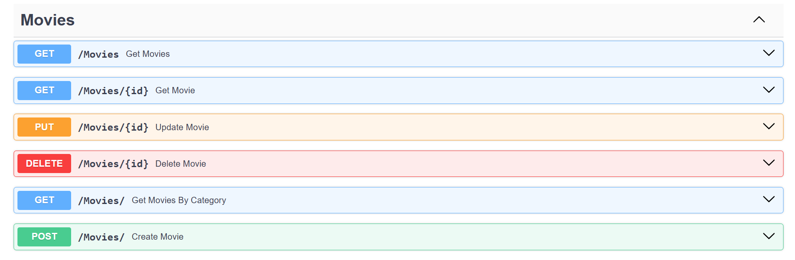
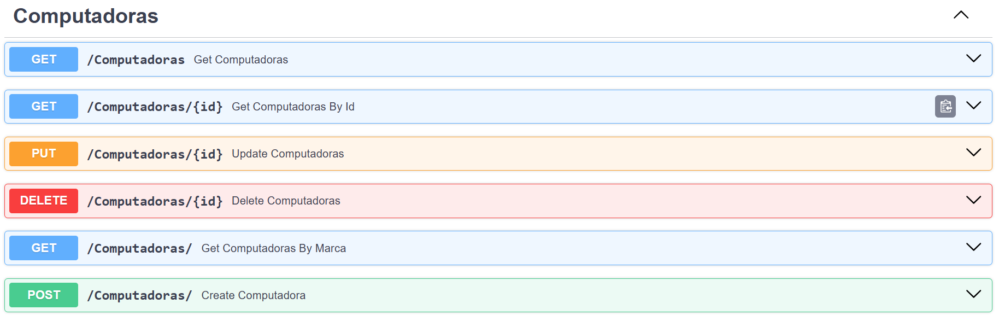

# mi_primera_api
Desplegamos una API sobre Movies y Computadoras. Todo esto montado en un Droplet de DigitalOcean, y con ayuda de un servidor de Nginx y PM2 se montara en la nube.
Implementación de un sistema CRUD sobre Movies y Computadoras, si deseas acceder a nuestra aplicación web, [haz clic aquí.](http://143.244.184.82/docs)

### CRUD Movies:

### CRUD Computadoras:

